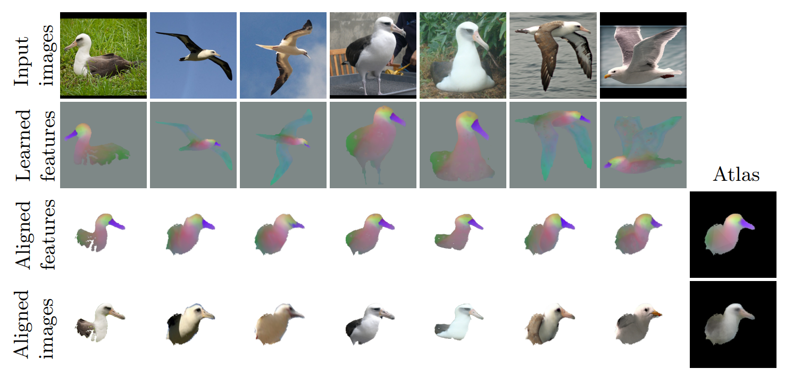

# SpaceJAM: a Lightweight and Regularization-free Method for Fast Joint Alignment of Images (ECCV 2024)
Nir Barel*, Ron Shapira Weber*, Nir Mualem, Shahaf Finder and Oren Ferifeld

[](https://arxiv.org/abs/2407.11850)

[](https://bgu-cs-vil.github.io/SpaceJAM/)


*Our framework jointly aligns a set of images of an object category in only a few minutes.
Top-to-bottom: 1) input images; 2) learned low-dimensional representations; 3) aligned features; 4) aligned images.
The last column depicts the average representation (atlas) obtained after training.*
## Requirements
To set up the environment for this project, you need to install the required dependencies listed in `environment.yml`. This file specifies the necessary packages and channels to ensure that your environment is properly configured.

 1. Install Conda: If you don't have Conda installed, you can get it by installing Miniconda or Anaconda. Download Miniconda or Download Anaconda.
 2. Create the Environment: To create a Conda environment with the dependencies specified in `environment.yml`, use the following command:
```bash
conda env create -f environment.yml
```
 3. Activate the Environment: Once the environment is created, activate it using:
```bash
conda activate spacejam
```

### Download data 
You can download and preprocess the following datasets according to the paper: 
```bash
python prepare_data/prepare_spair.py
python prepare_data/prepare_cub_class.py [--cub_acsm_class <class_num>]
python prepare_data/prepare_cub_subsets.py
```

In order to run SpaceJAM on custom images set, use:
```bash
python prepare_data/prepare_image_set.py --path <image-dir> [--out <out-dir>] 
```

### How to run
To train the entire model on one of the dataset, simply run:
```bash
python train.py --data_folder <processed-images-dir>
```
Please note that it is assumes that the data resides at ```data_folder/images```. 
For more details, run:
```bash
python train.py --help
```


## Cite
```
@inproceedings{Barel:ECCV:2024:spacejam,
      title={SpaceJAM: a Lightweight and Regularization-free Method for Fast Joint Alignment of Images}, 
      author={Nir Barel and Ron Shapira Weber and Nir Mualem and Shahaf E. Finder and Oren Freifeld},
      year={2024},
      booktitle={European Conference on Computer Vision},
}

```
